# Software Architecture
## VisionTrace AI — Intelligent Video Search Platform

**Version:** 1.0  
**Date:** August 5, 2026  
**Status:** Draft — Awaiting Approval

---

## Table of Contents

1. [High-Level System Architecture](#1-high-level-system-architecture)
2. [Frontend Architecture](#2-frontend-architecture)
3. [Backend Architecture](#3-backend-architecture)
4. [AI Pipeline Architecture](#4-ai-pipeline-architecture)
5. [Database Architecture](#5-database-architecture)
6. [Storage Architecture](#6-storage-architecture)
7. [Authentication Flow](#7-authentication-flow)
8. [API Request Flow](#8-api-request-flow)
9. [Video Processing Pipeline Flow](#9-video-processing-pipeline-flow)
10. [Search Pipeline Flow](#10-search-pipeline-flow)
11. [Deployment Architecture](#11-deployment-architecture)
12. [Scalability Architecture](#12-scalability-architecture)

---

## 1. High-Level System Architecture

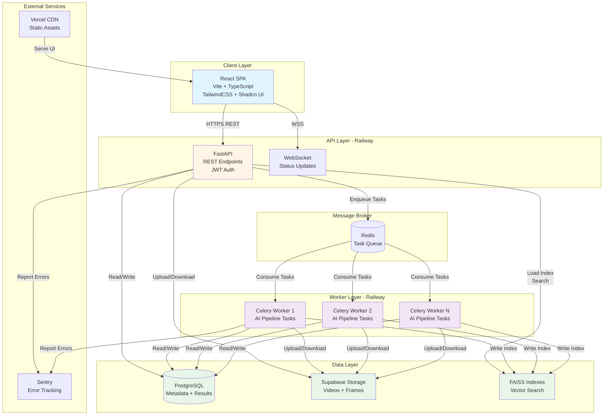

**Key Principles:**
- **Separation of Concerns:** UI, API, and Workers are independently deployable
- **Asynchronous Processing:** Long-running AI tasks handled by Celery workers
- **Stateless API:** All state persisted in PostgreSQL, Redis, or FAISS
- **Horizontal Scalability:** Add more worker replicas to increase throughput

---

## 2. Frontend Architecture

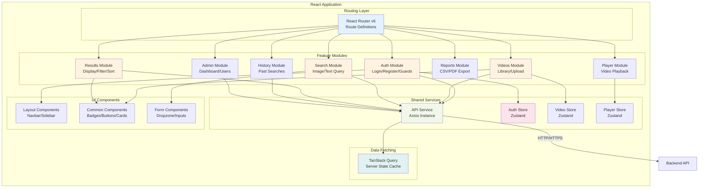

**Architecture Decisions:**

1. **Feature-First Structure:** Each feature (auth, videos, search) is self-contained with its own components, hooks, and types
2. **Zustand for Global State:** Lightweight state management for auth, video library, and player state
3. **TanStack Query for Server State:** Handles caching, refetching, and optimistic updates for API data
4. **Axios Interceptors:** Centralized token refresh, request ID injection, and error handling
5. **Component Co-location:** Feature components live alongside feature logic, not in a flat `/components` folder

---

## 3. Backend Architecture

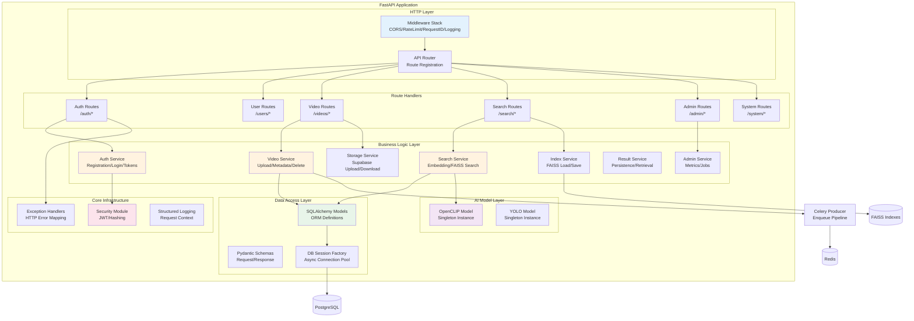

**Architecture Decisions:**

1. **Thin Route Handlers:** Routes only validate input, call services, and return responses
2. **Service Layer Encapsulation:** All business logic lives in services, not in routes
3. **Async SQLAlchemy:** Non-blocking database operations for high concurrency
4. **Singleton AI Models:** Models loaded once at startup, shared across requests
5. **Middleware Pipeline:** Request ID → Logging → Rate Limiting → CORS → Auth

---

## 4. AI Pipeline Architecture

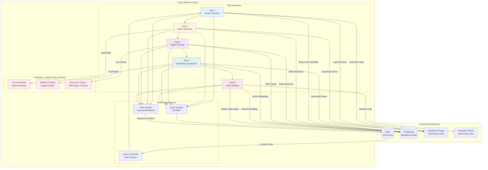

**Pipeline Flow:**
1. **Frame Extraction (T1):** OpenCV extracts frames at 1 FPS → upload to Supabase
2. **Object Detection (T2):** YOLOv8 detects objects in each frame → save bboxes to DB
3. **Object Tracking (T3):** ByteTrack assigns track IDs across frames → update DB
4. **Embedding Generation (T4):** OpenCLIP generates 512-dim vectors per detection → save to DB
5. **Index Building (T5):** Build FAISS index from all embeddings → serialize to disk

---

## 5. Database Architecture

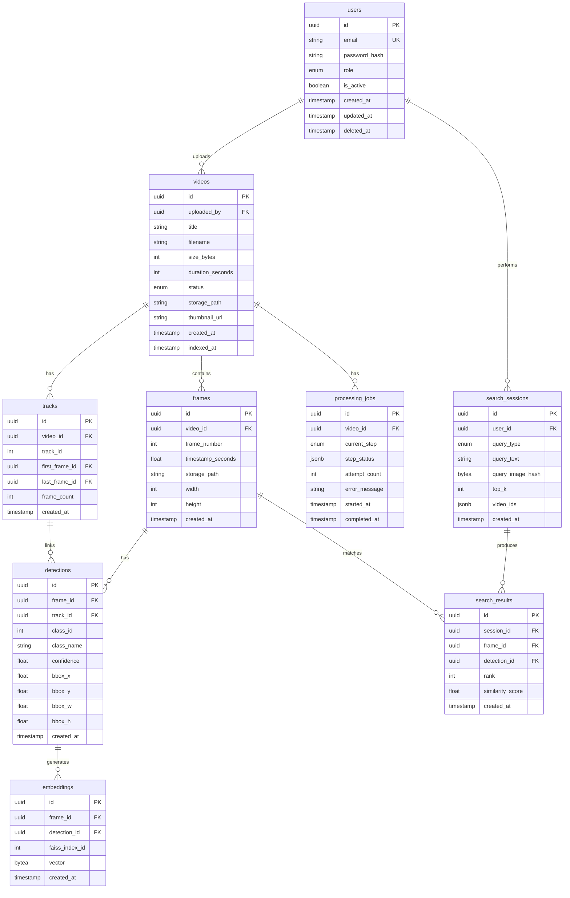

**Key Design Decisions:**

1. **UUID Primary Keys:** Enables distributed ID generation without coordination
2. **Soft Deletes:** `deleted_at` field on users and videos preserves audit trail
3. **JSONB for Flexibility:** `step_status` and `video_ids` use JSONB for dynamic structures
4. **Indexed Foreign Keys:** All FK columns have indexes for join performance
5. **Timestamp Auditing:** `created_at` and `updated_at` on all tables
6. **Vector Storage:** Embeddings stored as `bytea` (or `pgvector` extension if available)

**Indexes (Performance-Critical):**
- `videos.uploaded_by` (user video list)
- `frames.video_id, frames.frame_number` (ordered frame retrieval)
- `detections.frame_id` (join to frames)
- `embeddings.faiss_index_id` (FAISS result mapping)
- `search_sessions.user_id, search_sessions.created_at DESC` (history pagination)
- `search_results.session_id, search_results.rank` (result retrieval)

---

## 6. Storage Architecture

```mermaid
graph TB
    subgraph "Supabase Storage"
        subgraph "videos Bucket"
            V1[video_uuid_1.mp4<br/>Raw Upload]
            V2[video_uuid_2.mp4<br/>Raw Upload]
            VN[video_uuid_N.mp4<br/>Raw Upload]
        end

        subgraph "frames Bucket"
            F1[video_uuid_1/<br/>frame_0001.jpg<br/>frame_0002.jpg<br/>...]
            F2[video_uuid_2/<br/>frame_0001.jpg<br/>frame_0002.jpg<br/>...]
            FN[video_uuid_N/<br/>frame_0001.jpg<br/>frame_0002.jpg<br/>...]
        end
    end

    subgraph "Railway Persistent Volume"
        subgraph "FAISS Index Storage"
            I1[video_uuid_1.index<br/>FAISS IndexFlatIP]
            I2[video_uuid_2.index<br/>FAISS IndexFlatIP]
            IN[video_uuid_N.index<br/>FAISS IndexFlatIP]
        end
    end

    subgraph "PostgreSQL Database"
        META[Video Metadata<br/>Frame Metadata<br/>Detection Metadata<br/>Embedding Metadata]
    end

    API[FastAPI API] -->|Upload Video| V1
    WORKER[Celery Worker] -->|Download Video| V1
    WORKER -->|Upload Frames| F1
    WORKER -->|Download Frames| F1
    API -->|Generate Signed URL| V1
    API -->|Generate Signed URL| F1

    WORKER -->|Write Index| I1
    API -->|Load Index for Search| I1

    API -->|Read/Write Metadata| META
    WORKER -->|Read/Write Metadata| META

    style V1 fill:#e3f2fd
    style F1 fill:#fff3e0
    style I1 fill:#f3e5f5
    style META fill:#e8f5e9
```

**Storage Strategy:**

1. **Videos Bucket (Supabase):**
   - Raw uploaded video files stored with original format
   - Access via short-lived signed URLs (1-hour expiry)
   - Public access disabled; all access requires authentication

2. **Frames Bucket (Supabase):**
   - Extracted frames organized by `video_id` prefix
   - JPEG format at 80% quality for storage efficiency
   - Thumbnail generation: resize to 320px max dimension
   - Signed URLs for thumbnails with 24-hour expiry

3. **FAISS Index Files (Railway Persistent Volume):**
   - One `.index` file per video
   - Named by `video_id.index` for easy lookup
   - Loaded into memory on-demand for search
   - No replication (can be rebuilt from DB if lost)

4. **PostgreSQL (Railway Managed):**
   - All metadata and relational data
   - Embeddings stored as `bytea` (512 floats × 4 bytes = 2 KB per embedding)
   - Daily automated backups via Railway

**Scaling Considerations:**

- **Storage Growth:** ~100 MB per hour of video (1 FPS extraction, JPEG)
- **Index Growth:** ~2 KB per detection embedding
- **Example:** 1000 hours of video = 100 GB storage + ~5 GB embeddings + ~500 MB indexes

---

## 7. Authentication Flow

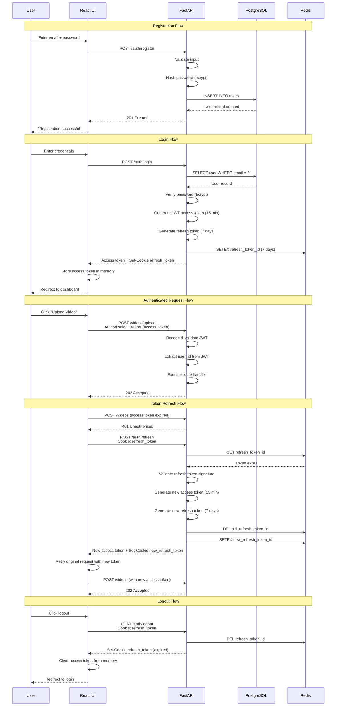

**Security Properties:**

1. **Short-Lived Access Tokens:** 15-minute expiry reduces window for token theft
2. **HttpOnly Refresh Tokens:** Cannot be accessed by JavaScript (XSS protection)
3. **Token Rotation:** Each refresh invalidates the old refresh token
4. **Redis Whitelist:** Only valid refresh tokens exist in Redis; revocation is instant
5. **Logout = Revocation:** Logout deletes the refresh token from Redis

---

## 8. API Request Flow

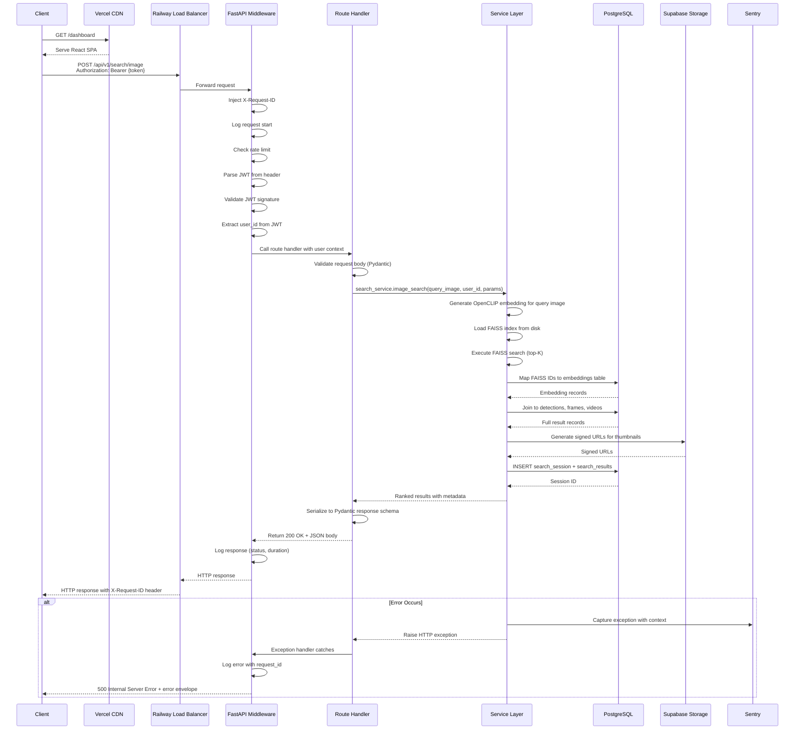

**Middleware Stack (Execution Order):**

1. **Request ID Injection:** Generate UUID, attach to `request.state.request_id`
2. **Structured Logging:** Bind request_id, method, path to log context
3. **Rate Limiting:** Check Redis counter; return 429 if exceeded
4. **CORS Validation:** Verify `Origin` header matches allowlist
5. **JWT Authentication:** Decode token, attach `request.state.user` (routes can override with `Depends`)
6. **Exception Handling:** Catch all exceptions, log, return standardized error envelope
7. **Response Logging:** Log status code, duration, user_id

---

## 9. Video Processing Pipeline Flow

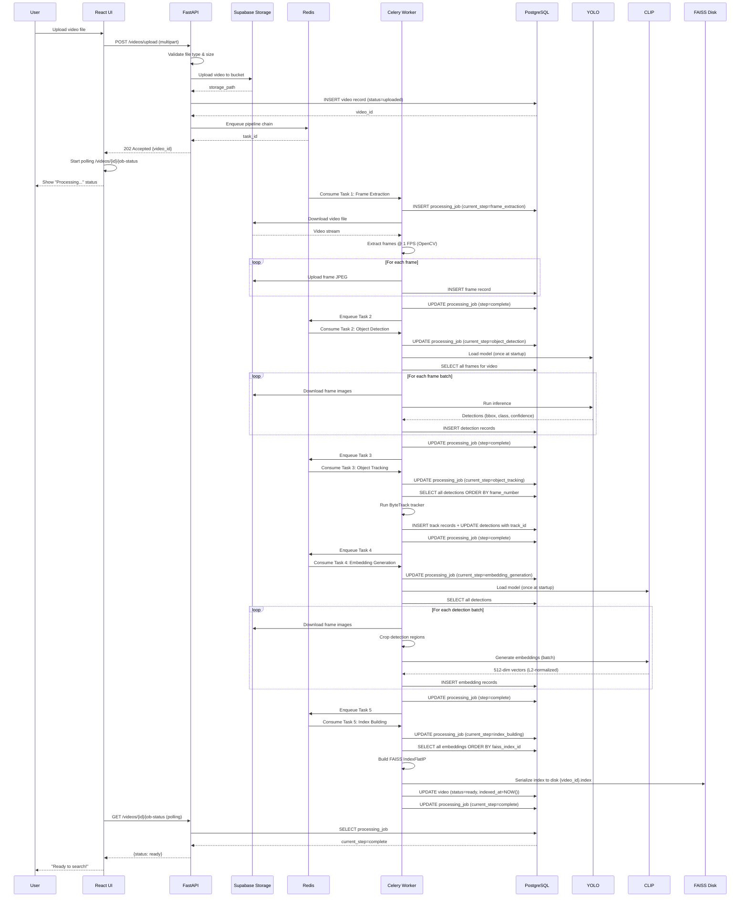

**Pipeline Duration (30-minute video @ 1 FPS):**
- Frame Extraction: ~2 min
- Object Detection: ~6 min (CPU) / ~1 min (GPU)
- Object Tracking: ~30 sec
- Embedding Generation: ~5 min (CPU) / ~1 min (GPU)
- Index Building: ~10 sec
- **Total (CPU):** ~14 minutes
- **Total (GPU):** ~5 minutes

---

## 10. Search Pipeline Flow

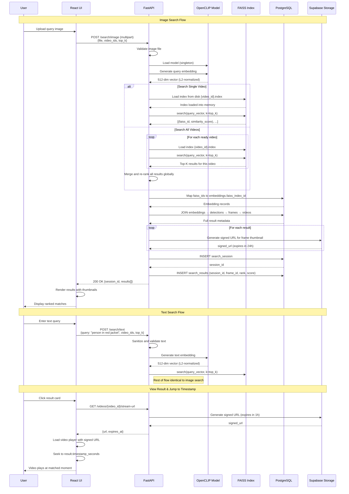

**Search Performance:**
- **Query Embedding Generation:** ~50ms (CLIP inference)
- **FAISS Search (per index):** ~10–100ms depending on index size
  - 10K vectors: ~10ms
  - 100K vectors: ~50ms
  - 1M vectors: ~200ms (switch to IndexIVFFlat)
- **Database Join & Metadata:** ~50ms
- **Signed URL Generation:** ~10ms per result
- **Total End-to-End:** < 3 seconds for 20 results from a 100K-vector index

---

## 11. Deployment Architecture

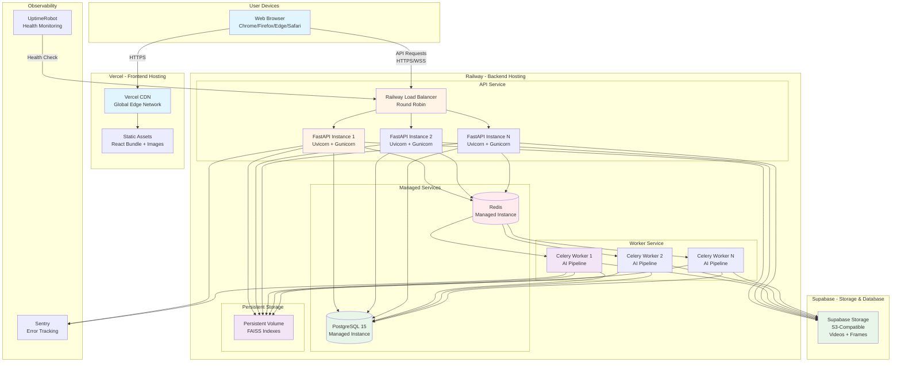

**Deployment Services:**

| Service | Provider | Purpose | Scaling |
|---|---|---|---|
| Frontend | Vercel | React SPA hosting, CDN distribution | Auto-scaling edge network |
| Backend API | Railway | FastAPI REST API | Horizontal: 2–N instances |
| Celery Workers | Railway | AI pipeline processing | Horizontal: 2–N workers |
| PostgreSQL | Railway | Relational data persistence | Managed vertical scaling |
| Redis | Railway | Task broker + result backend | Managed vertical scaling |
| FAISS Indexes | Railway Persistent Volume | Vector index storage | Mounted to all API + worker instances |
| Video/Frame Storage | Supabase Storage | S3-compatible blob storage | Unlimited, pay-per-GB |
| Error Tracking | Sentry | Exception logging | Managed SaaS |
| Uptime Monitoring | UptimeRobot | Health check polling | Managed SaaS |

**Environment Variables (Deployment):**

Frontend (Vercel):
```
VITE_API_BASE_URL=https://api.visiontrace.railway.app
VITE_SUPABASE_URL=https://<project>.supabase.co
VITE_SUPABASE_ANON_KEY=<anon_key>
```

Backend (Railway):
```
DATABASE_URL=<railway_postgres_connection_string>
REDIS_URL=<railway_redis_connection_string>
SUPABASE_URL=https://<project>.supabase.co
SUPABASE_SERVICE_KEY=<service_role_key>
SECRET_KEY=<random_256bit_key>
FAISS_INDEX_PATH=/data/faiss_indexes
SENTRY_DSN=<sentry_project_dsn>
```

**CI/CD Pipeline:**

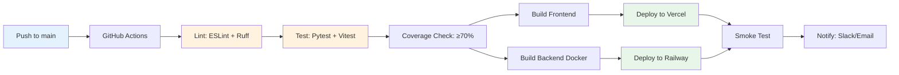

---

## 12. Scalability Architecture (Millions of Frames)

```mermaid
graph TB
    subgraph "Phase 1 - Current Architecture (v1.0)"
        subgraph "Bottlenecks"
            B1[Single FAISS Index per Video<br/>O(N) search time]
            B2[Local Disk Index Storage<br/>Limited by instance disk]
            B3[CPU-Only AI Models<br/>Slow inference]
            B4[Single PostgreSQL Instance<br/>Connection pool saturation]
        end
    end

    subgraph "Phase 2 - Scale to 1M Frames per Video"
        subgraph "Optimizations"
            O1[Switch to FAISS IndexIVFFlat<br/>Sub-linear search O(sqrt N)]
            O2[GPU-Accelerated Workers<br/>5-10x faster inference]
            O3[Read Replicas for PostgreSQL<br/>Offload read-heavy queries]
            O4[Index Caching Strategy<br/>LRU cache in API memory]
        end
    end

    subgraph "Phase 3 - Scale to 100M Frames Total"
        subgraph "Distributed Architecture"
            D1[Object Storage for Indexes<br/>S3/Supabase Storage]
            D2[Horizontal Database Sharding<br/>Partition by video_id]
            D3[Distributed FAISS<br/>Index shards across nodes]
            D4[Multi-Region Deployment<br/>Geo-distributed workers]
        end
    end

    subgraph "Phase 4 - Scale to 1B+ Frames"
        subgraph "Advanced Techniques"
            A1[Vector Database<br/>Milvus/Weaviate/Qdrant]
            A2[Approximate Search<br/>Product Quantization PQ]
            A3[Hierarchical Indexing<br/>Coarse-to-fine search]
            A4[Edge Inference<br/>On-device frame extraction]
        end
    end

    B1 --> O1
    B2 --> O2
    B3 --> O3
    B4 --> O4

    O1 --> D1
    O2 --> D2
    O3 --> D3
    O4 --> D4

    D1 --> A1
    D2 --> A2
    D3 --> A3
    D4 --> A4

    style B1 fill:#ffebee
    style O1 fill:#fff3e0
    style D1 fill:#e3f2fd
    style A1 fill:#e8f5e9
```

### Scaling Strategy by Data Volume

| Data Volume | Strategy | Changes Required |
|---|---|---|
| **< 100K frames** | Current v1.0 architecture | None |
| **100K – 1M frames** | Switch to IndexIVFFlat | Update `index_builder.py`, retrain index |
| **1M – 10M frames** | Add GPU workers | Deploy GPU Railway instances |
| **10M – 100M frames** | Shard PostgreSQL, use object storage for indexes | Citus extension or partition tables; move indexes to S3 |
| **100M – 1B frames** | Distributed FAISS or vector DB | Migrate to Milvus/Qdrant/Weaviate |
| **> 1B frames** | Hierarchical search + PQ compression | Coarse video-level index → fine frame-level index |

### Index Type Comparison

| Index Type | Search Time | Build Time | Memory | Accuracy | Use Case |
|---|---|---|---|---|---|
| `IndexFlatIP` (v1.0) | O(N) | O(N) | N vectors | 100% | < 100K vectors |
| `IndexIVFFlat` | O(√N) | O(N log N) | N vectors + centroids | 95–99% | 100K – 10M vectors |
| `IndexIVFPQ` | O(√N) | O(N log N) | Compressed | 90–95% | > 10M vectors |
| Vector DB (Milvus) | O(log N) | O(N log N) | Distributed | 95–99% | > 100M vectors |

### Database Scaling Roadmap

**Current (v1.0):** Single PostgreSQL instance with connection pooling

**Phase 2 (10K videos):**
- Add read replicas for `SELECT` queries (videos, frames, results)
- Write operations remain on primary

**Phase 3 (100K videos):**
- Partition `frames`, `detections`, `embeddings` by `video_id`
- Each partition = 1000 videos
- Queries scoped to partition via `video_id` in `WHERE` clause

**Phase 4 (1M+ videos):**
- Multi-tenant sharding via Citus extension
- Each shard = geographic region or customer
- Cross-shard queries avoided via application logic

### Worker Scaling Roadmap

**Current (v1.0):** 2–4 CPU workers

**Phase 2 (GPU Acceleration):**
- Deploy GPU-enabled Railway instances (NVIDIA T4 or A10)
- 5–10x speedup on Steps 2 (YOLO) and 4 (CLIP)
- Cost: ~$1.50/hour per GPU instance

**Phase 3 (Horizontal Scaling):**
- Scale worker count based on queue depth
- Auto-scaling trigger: if `queue_depth > 10` for > 5 minutes, add +2 workers
- Max 20 workers per deployment

**Phase 4 (Distributed Processing):**
- Multi-region worker deployments (US-East, US-West, EU)
- Video routed to nearest region based on upload location
- Reduces latency for storage uploads/downloads

### Cost Projections

| Scale | Monthly Cost (Estimate) |
|---|---|
| 100 videos, 1K searches/month | ~$50 (Railway Hobby + Supabase Free) |
| 1K videos, 10K searches/month | ~$200 (Railway Pro + Supabase Pro) |
| 10K videos, 100K searches/month | ~$1,500 (Railway Scale + GPU workers + Supabase Team) |
| 100K videos, 1M searches/month | ~$10K (Dedicated infrastructure + multi-region) |

**Cost Optimization:**
- Archive old videos to cold storage (Glacier) after 90 days
- Compress FAISS indexes with Product Quantization (50% size reduction)
- Batch search queries to amortize FAISS index load time

---

## Architecture Summary

**VisionTrace AI is designed for:**
1. **Separation of Concerns:** Independent frontend, API, and worker layers
2. **Asynchronous Processing:** Long-running AI tasks offloaded to Celery workers
3. **Stateless API:** All state in PostgreSQL/Redis/FAISS; API instances are disposable
4. **Horizontal Scalability:** Add more workers or API instances without code changes
5. **Cost-Effective CPU-First Approach:** Optimized for CPU deployment; GPU as enhancement
6. **Future-Proof Index Strategy:** Easy migration from IndexFlatIP → IndexIVFFlat → Vector DB

**Next Steps:**
- Implement M0 (Foundation) and M1 (Auth + Upload) milestones
- Deploy to Railway + Vercel for staging environment
- Benchmark pipeline performance on test videos
- Optimize before moving to M2 (AI Pipeline)

---

**End of Software Architecture Document**
